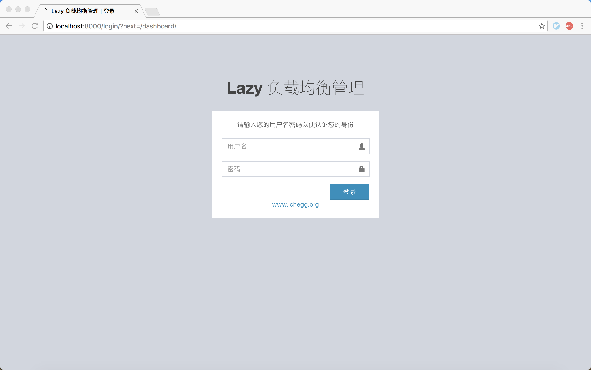
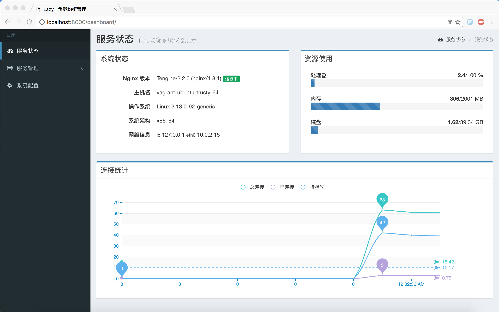
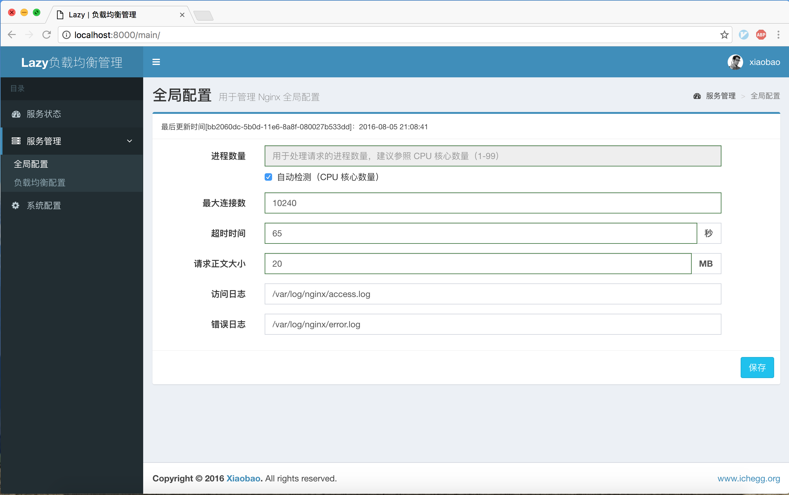
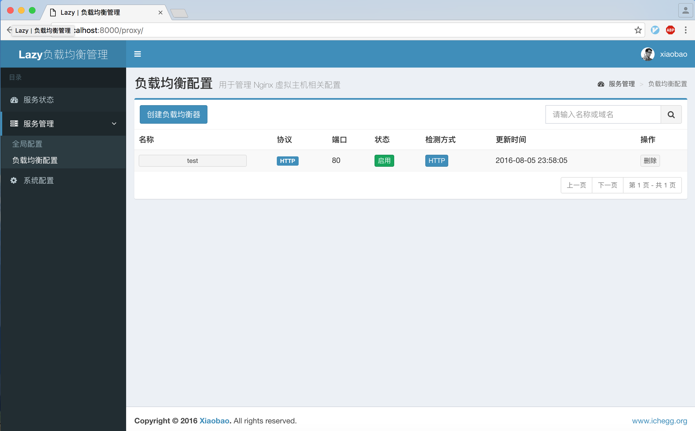
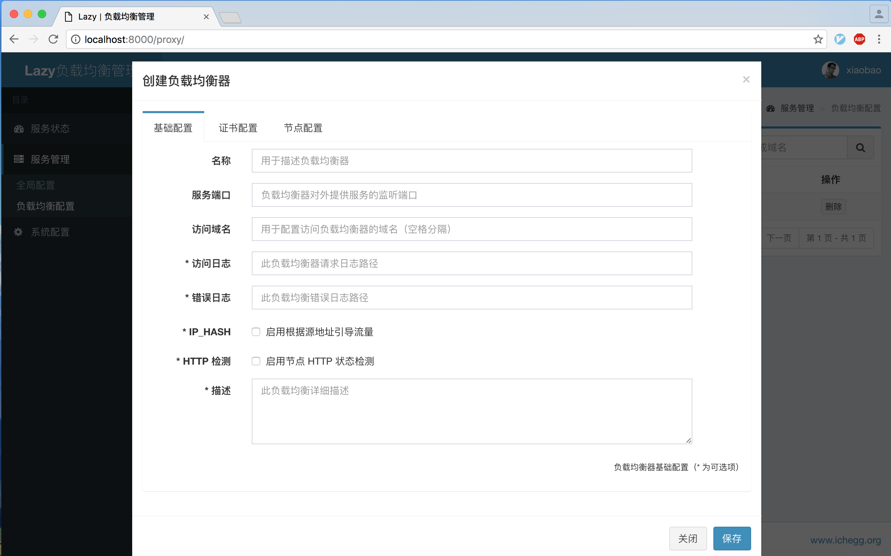
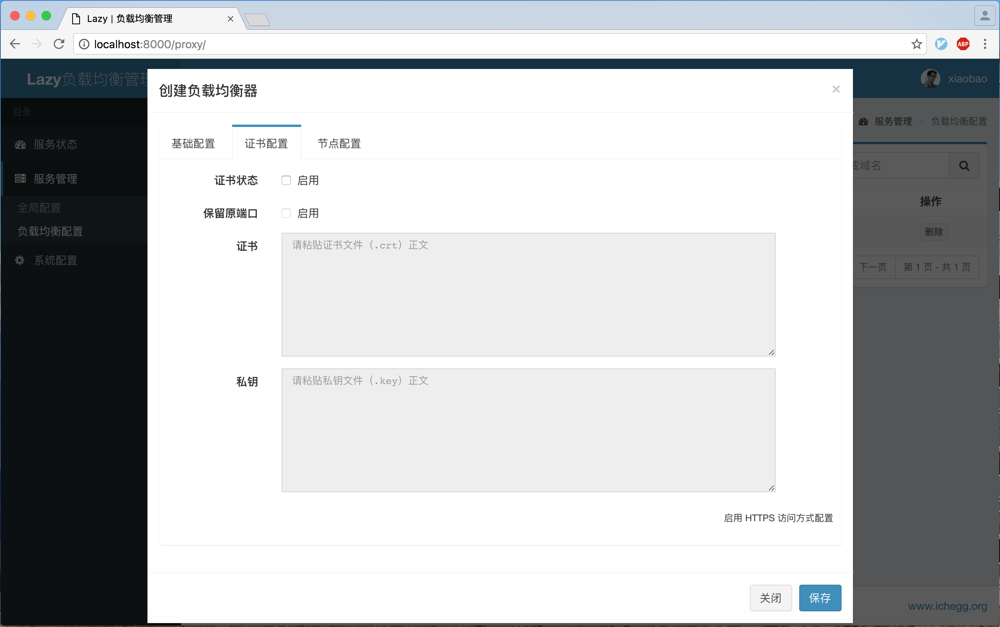
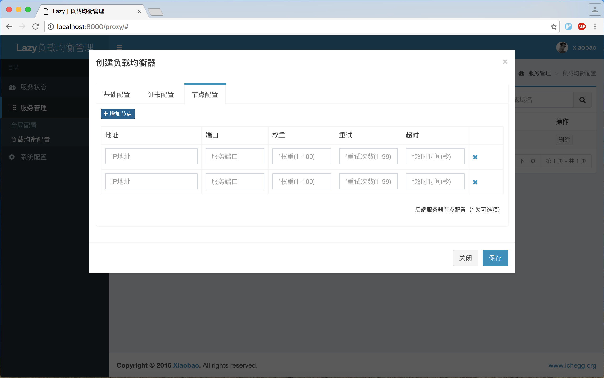
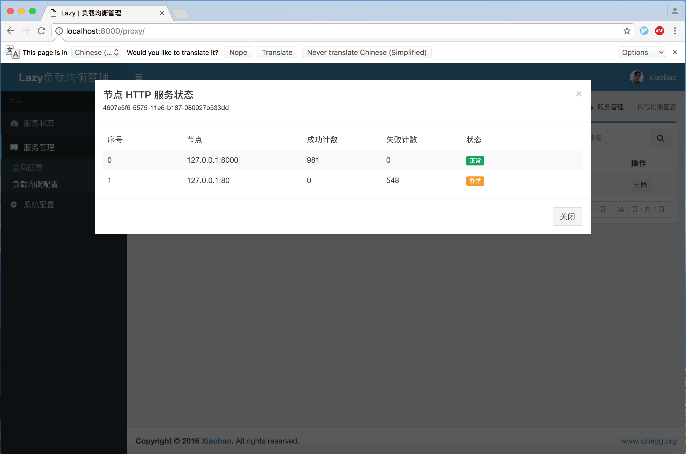
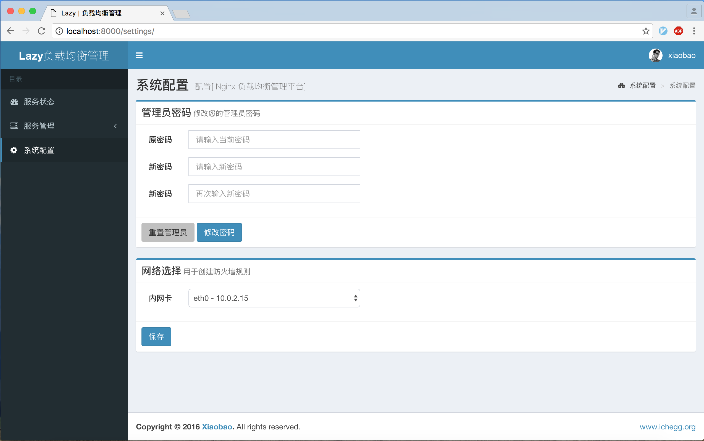

## 前言
项目起源于好哥们需要一个 7 层负载均衡器，无奈商业负载均衡器成本高昂，操作复杂。又没有特别喜欢（好看，好用）的开源产品，作为一名大 Ops 怎么能没有办法？正好最近在看 Django 框架，尝试自己给 Nginx 画皮，项目诞生！非专业开发，代码凑合看吧。欢迎反馈！
<!--more-->

> * 项目基于 [Django](https://www.djangoproject.com/) + [AdminLTE](https://www.almsaeedstudio.com/) 构建，在 Ubuntu 14.04 上测试通过；
> * 因为增加了 iptables 自动控制，所以暂时不支持 docker 方式部署；需要本地测试的同学请使用 vagrant 方式
> * 因为使用了 [nginx_upstream_check_module](http://tengine.taobao.org/document/http_upstream_check.html) 模块，以及为了后续扩展方便，建议大家直接使用 [Tengine](http://tengine.taobao.org/) 替代 Nginx 服务

## 项目地址
* **GITHUB** -  [https://github.com/v55448330/lazy-balancer](https://github.com/v55448330/lazy-balancer)
* **OSCHINA** -  [http://git.oschina.net/v55448330/lazy-balancer](http://git.oschina.net/v55448330/lazy-balancer)

## 更新
* 将 Nginx 更换为 Tengine 以提供更灵活的功能支持以及性能提升
* 新增 HTTP 状态码方式检测后端服务器，默认 TCP 方式
* 新增 HTTP 状态码方式支持查看后端服务器状态
* 新增自定义管理员用户
* 更新 Vagrantfile
* 修复部分 Bug

## 功能
* Nginx 可视化配置
* Nginx 负载均衡（反向代理）配置
* Nginx 证书支持
* 系统状态监测
* 自动维护防火墙规则（白名单）
* 支持 TCP/HTTP 方式的后端节点宕机检测

## 演示

