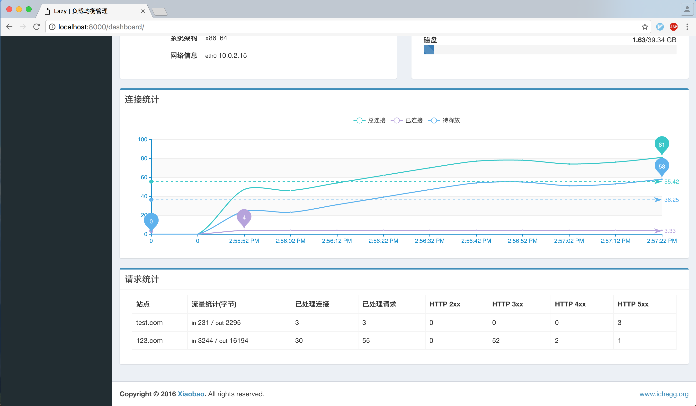
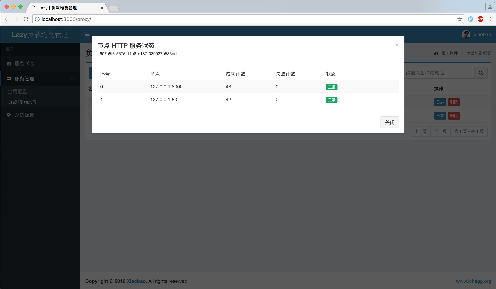
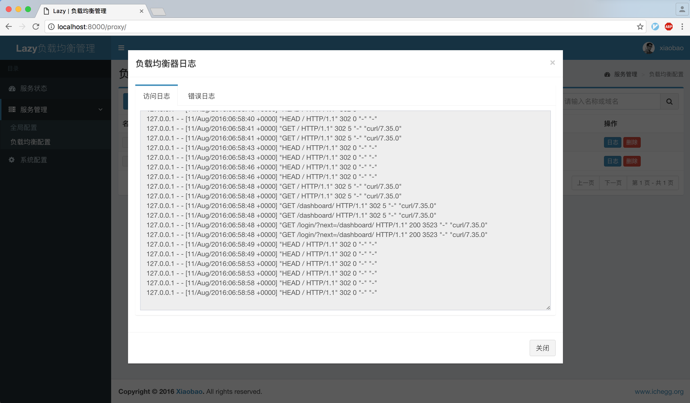

## 项目地址
- GITHUB - https://github.com/v55448330/lazy-balancer
- 码云 - http://git.oschina.net/v55448330/lazy-balancer
- OSCHINA - http://www.oschina.net/p/nginx-balancer
<!--more-->

## 更新

- 更新 HTTP 状态码方式检测方法，基于 `nginx_upstream_check_module` 模块
- 新增站点请求实时统计功能，基于 `nginx_ngx_http_reqstat_module` 模块
- 新增配置通过文件备份和还原
- 新增实时查看负载均衡日志功能
- 优化 `Nginx` 相关配置
- 更换 `pycurl` 为 `requests`
- 前端细节调整

## 演示

