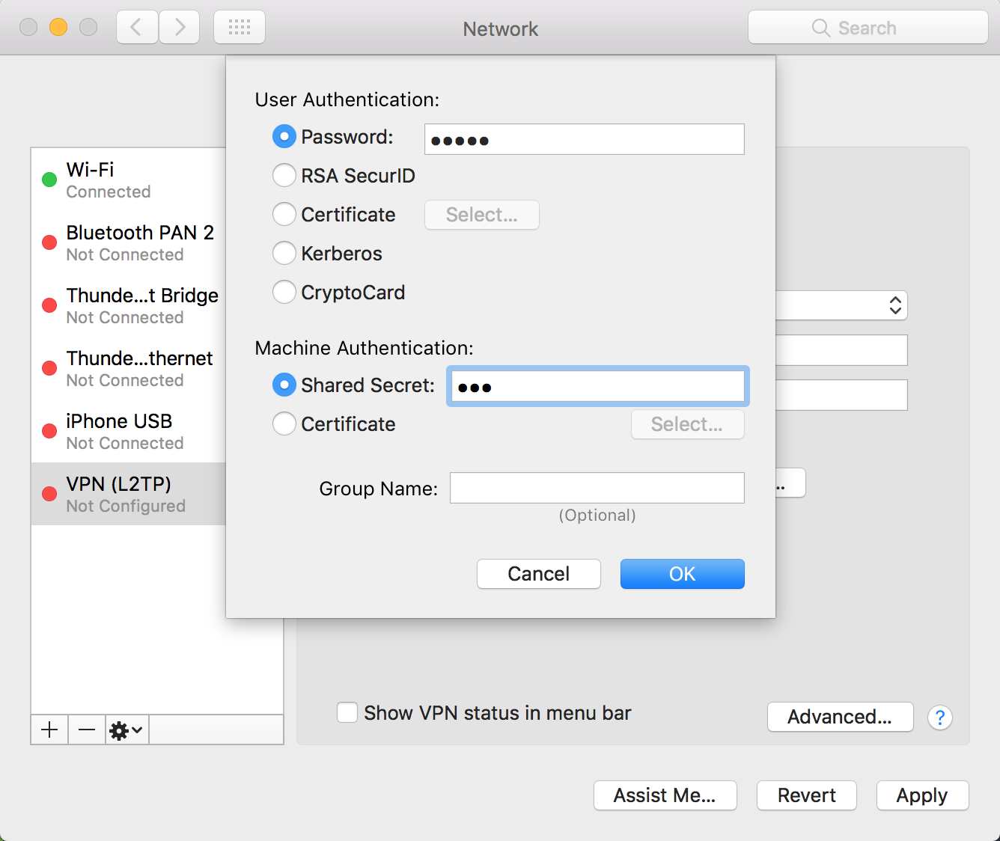

## 前言
自从苹果于今年 6 月 15 日发布了最新的 IOS 10 以及 macOS Sierra 10.12 操作系统，于第一时间尝鲜，经过一段时间试用，新系统表现良好，但是其中一个小细节让人无法忍受。那就是取消了对 [**PPTP**](http://baike.baidu.com/view/32771.htm) 的支持！不过想想也是，PPTP 在功能，加密等方面均已被时代淘汰，停止支持也在情理之中。尤其在我朝 [**伟大的墙**](http://baike.baidu.com/view/987882.htm) 的围追堵截下，PPTP 这等协议已经形同虚设。好在苹果在新系统中保留了 [**L2TP**](http://baike.baidu.com/view/32692.htm) 协议支持，好吧，请出我牛逼的 [**RouterOS**](http://www.mikrotik.com/) ！整 ...
<!--more-->

## 关于 L2TP
L2TP ，全称 `Layer 2 Tunneling Protocol` ，从字面上看，这玩意工作在 2 层。通过封装和扩展 [PPP](http://baike.baidu.com/subview/30514/8100295.htm) 协议实现 VPN 隧道的功能。但是 L2TP 不会对隧道内的数据进行加密，所以 L2TP 一般和 [IPsec](http://baike.baidu.com/view/137005.htm) 共同使用，先由 L2TP 封装 2 层数据，再由 IPsec 封装 IP 数据包共同提供服务。

## 开整
> 这里是图，请脑补，另外这里的环境如果没说都是 `RouterOS v6.12`

### 启动 L2TP 服务
> 因为会和 IPsec 共同使用，所以此处默认配置文件不需要选择加密

```
/interface l2tp-server server
set enabled=yes default-profile=default
```

### 配置 IPsec
> `secret` 参数是您的预共享秘钥，`enc-algorithm` 参数请选择您设备支持的加密方式，不知道就别改，可选参数为 `3des,aes-128,aes-192,aes-256`

```
/ip ipsec peer
add address=0.0.0.0/0 local-address=0.0.0.0 passive=yes port=500 \
auth-method=pre-shared-key secret="123" generate-policy=port-strict \
exchange-mode=main-l2tp send-initial-contact=yes nat-traversal=yes \
hash-algorithm=sha1 enc-algorithm=3des \
dh-group=modp1024 lifetime=1d dpd-interval=2m dpd-maximum-failures=5
```

### 创建地址池和账号

```
/ip pool add name=vpn-pool range=192.168.99.2-192.168.99.100

/ppp profile
set default local-address=192.168.99.1 remote-address=vpn-pool

/ppp secret
add name=xiaobao password=12354
add name=crazy password=12354
```

### 防火墙规则

```
/ip firewall filter
add chain=input protocol=udp port=1701,500,4500
add chain=input protocol=ipsec-esp
```

### 连接
在您的 IOS/Mac/Win 设备上创建 L2TP over IPsec VPN 并填入账号密码和预共享秘钥即可。




