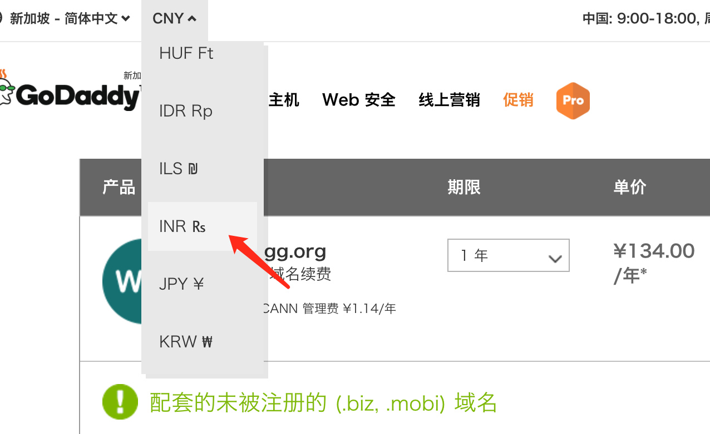
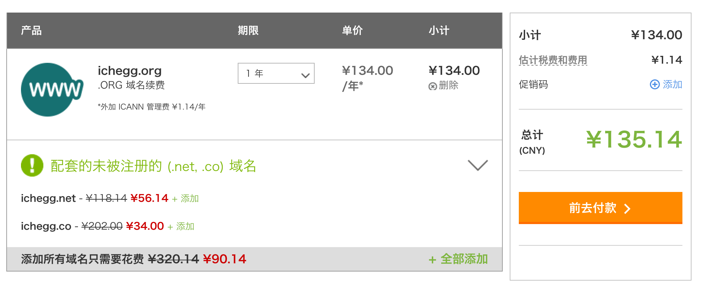
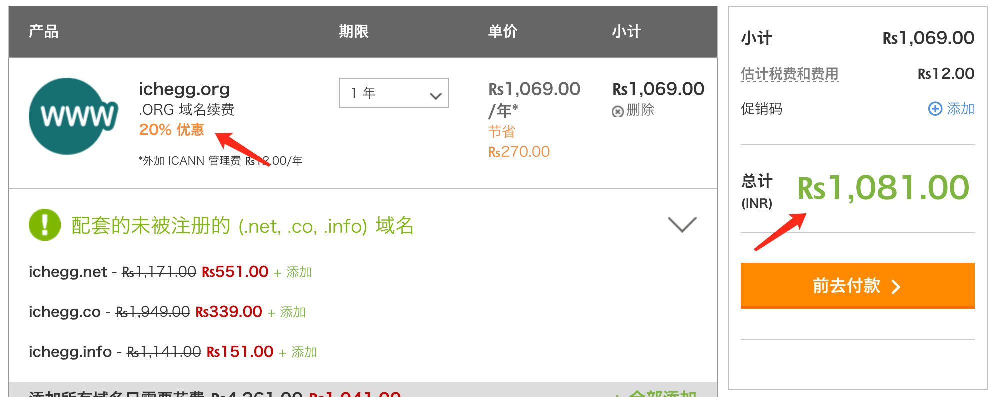
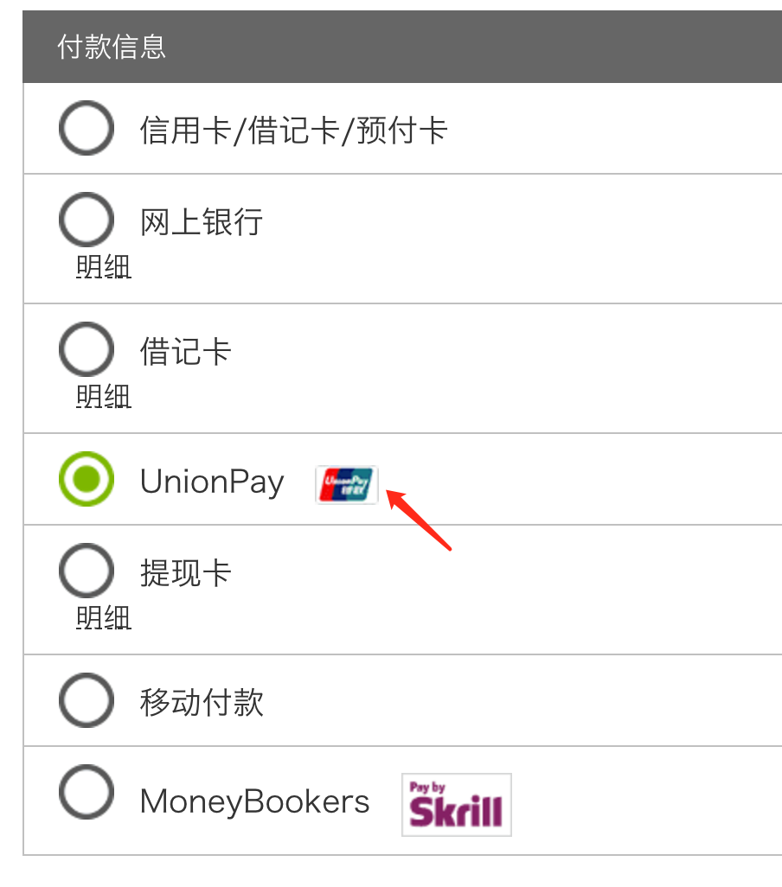

## 啥情况
大半夜突然睡醒了，莫名其妙想起来好像域名 **www.ichegg.org** 要到期了。咋办，续费呗。。

域名是在 [**去爸爸(Godaddy)**](http://www.godaddy.com) 注册的，当年注册的时候，某度、某宝流传有大量的优惠码，虽然省钱不多，但是也是钱嘛。结果转了一圈，发现所有的优惠码只针对 **新产品**、 **主机**、 **邮箱** 等等。难道无解了吗？？
<!--more-->

## 福利到
犯困了，打算放弃了。。一筹莫展之际，无聊点了点鼠标，奇迹发生了。。如图所示，将 **支付币种** 改为 **印度卢比** ，就是那个 **INR Rs**，可以看到，优惠出现了。经过验证，支持 **银联** 方式付款！

- 币种修改

- 修改前

- 修改后

- 付款方式

可以看到，优惠后为 1081 卢比，根据今天汇率，折合人民币约 110.35 元，节省了 25 块人民币。

话说要是你们省的多了，可以点下下面的打赏分我点。哈哈。。

> **注意事项：**
> 
> 1. 不同 **域名后缀** 优惠幅度不同，续费年限 **越长** 优惠幅度 **越低**
> 2. 付款时支付平台有可能被墙，建议 **翻墙**，确保支付成功
