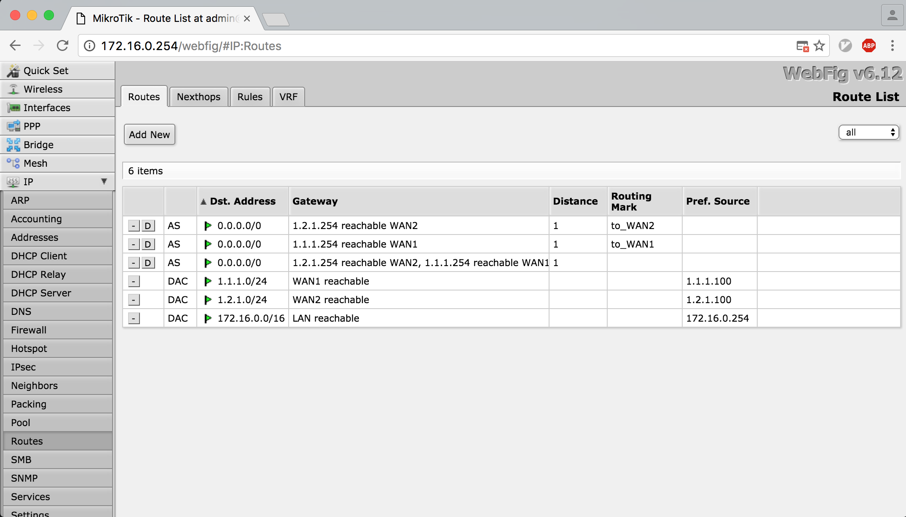
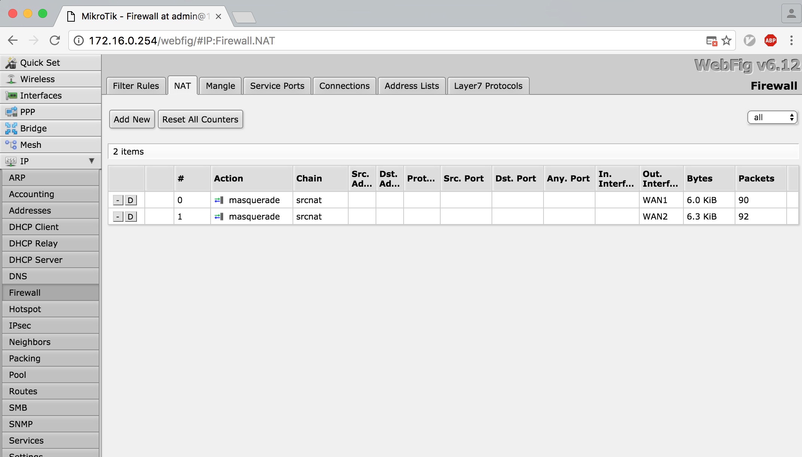
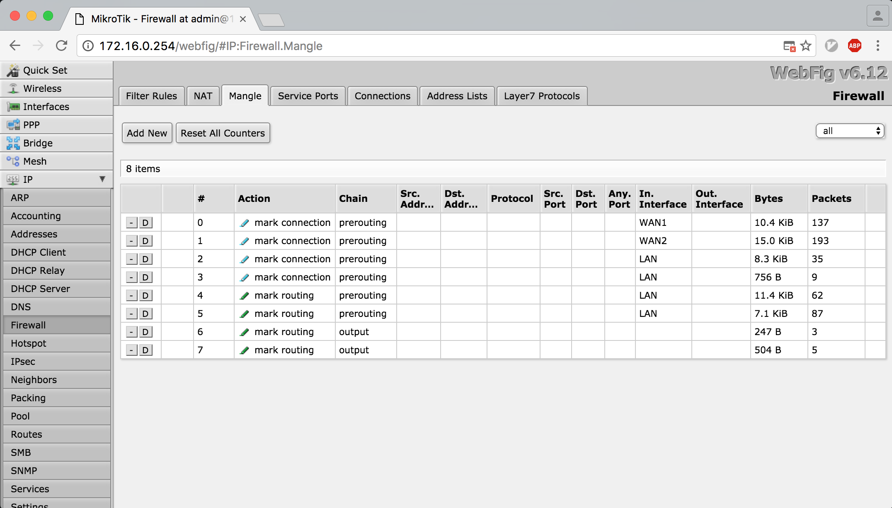

## 前言
前段时间遇到一个很好玩的事情，哥们单台路由器上有多条 ISP 线路，想将路由器替换成 [RouterOS](http://www.mikrotik.com/) ；根据已接触到网络常识，一台路由器上不允许存在多条默认路由。但根据反馈，[海蜘蛛](http://www.hi-spider.com/) 都可以实现的功能，没理由我牛逼的大 RouterOS 搞不定！折腾折腾 ...
<!--more-->

## RouterOS 简介
懒得写，[自己看吧](http://baike.baidu.com/view/386253.htm)，反正很牛逼！

## 折腾前扯一扯
> 真实环境不便透露，这里均为实验环境。**PCC** 规则需要至少 2 条 ISP 线路接入，这里为 2 条。


上面那个很丑的图是实验拓扑，可以看到：
- 有 **2条** 公网线路，地址为 `1.1.1.100` 和 `1.2.1.100`
- 内网地址忘了写，为 `172.16.0.254` ，内网找了台测试服务器 `172.16.0.222`

基本配置就是这样了，先介绍下 **PCC** ：

**PCC** 全称 **per connection classifier** ，是 RouterOS 从 `v3.24` 版本后提供的功能，允许你将流量按照：源地址，源端口，目的地址，目的端口等规则进行分流，从而实现网络负载均衡功能。大概原理是查看 `IP 包头` 通过特定 Hash 算法进行比较并根据设置的规则捕获数据包。

通过 **PCC** 的手段，就可以避免出现多个网关的问题，通过 RouterOS 强大的数据包标记功能 (IP/Firewall/Mangle) ，可以将流量自动分流为多组并创建动态路由表，指向不同网关即可。

## 开始折腾
> 根据上面的配置，修改内网网卡为名称为 **LAN** ，外网网卡分别为 **WAN1** 和 **WAN2** ，并配置相应 **IP** 地址，这里不再赘述基础配置。

### 标记公网流量
> 因为有两条公网线路，流量进来的时候网络必须知道是从那条线路进入，同时从相同的线路出局，所以我们需要标记所有公网进入的流量用以区分

```
/ip firewall mangle
add action=mark-connection chain=prerouting in-interface=WAN1 \
    new-connection-mark=WAN1_conn
add action=mark-connection chain=prerouting in-interface=WAN2 \
    new-connection-mark=WAN2_conn
```

### 创建 **PCC** 规则
> 这里我们选择根据源地址的方式创建 **PCC** 规则，需要注意的是，**PCC** 策略是从 0 开始计数，所以这里两条线路的配置为 `2/0` 和 `2/1`

```
/ip firewall mangle
add action=mark-connection chain=prerouting connection-mark=no-mark \
    dst-address-type=!local in-interface=LAN new-connection-mark=WAN1_conn \
    per-connection-classifier=both-addresses:2/0
add action=mark-connection chain=prerouting connection-mark=no-mark \
    dst-address-type=!local in-interface=LAN new-connection-mark=WAN2_conn \
    per-connection-classifier=both-addresses:2/1
```

### 根据标记创建动态策略路由
> 标记到数据包后，我们需要根据这些标记，分别创建路由规则，解决多网关以及流量负载均衡的问题

```
/ip firewall mangle
add action=mark-routing chain=prerouting connection-mark=WAN1_conn \
    in-interface=LAN new-routing-mark=to_WAN1
add action=mark-routing chain=prerouting connection-mark=WAN2_conn \
    in-interface=LAN new-routing-mark=to_WAN2
add action=mark-routing chain=output connection-mark=WAN1_conn \
    new-routing-mark=to_WAN1
add action=mark-routing chain=output connection-mark=WAN2_conn \
    new-routing-mark=to_WAN2
```

### 创建路由
> 为所有规则创建路由表

```
/ ip route
add dst-address=0.0.0.0/0 gateway=1.1.1.254 routing-mark=to_WAN1 check-gateway=ping
add dst-address=0.0.0.0/0 gateway=1.2.1.254 routing-mark=to_WAN2 check-gateway=ping
```

### 创建故障转移路由
> 防止任意线路中断

```
/ ip route
add check-gateway=ping distance=1 gateway=1.1.1.254,1.2.1.254
```

### 创建 NAT 规则
> 想上网就靠它了 ...

```
/ip firewall nat
add action=masquerade chain=srcnat out-interface=WAN1
add action=masquerade chain=srcnat out-interface=WAN2
```

### 创建策略
> 因为有了策略路由，所以流量有可能被强制引导到特定网关，所以需要使用下面这些规则避免这种情况

```
/ip firewall mangle
add chain=prerouting dst-address=1.1.1.0/24 in-interface=LAN
add chain=prerouting dst-address=1.2.1.0/24 in-interface=LAN
```

此时，**PCC** 策略就建立完成了，通过 `172.16.0.222` 访问公网，你会发现，2 条线路中断任意一条均不影响正常访问，同时开启迅雷等支持 P2P 方式下载的软件会发现带宽增加了一倍！

### 创建端口映射规则
> 因为此时为 2 条出口线路，所以端口转发规则也需要建立两条，因为之前根据入口标记了流量，所以从任意线路进入的流量均会原路返回！
> 这条规则将会把 2 条线路的 `tcp80` 端口转发到 `172.16.0.222` 机器的 `tcp80` 端口。

```
/ip firewall nat
add action=dst-nat chain=dstnat dst-address=1.1.1.100 dst-port=80 \
    protocol=tcp to-addresses=172.16.0.222 to-ports=80
add action=dst-nat chain=dstnat dst-address=1.2.1.100 dst-port=80 \
    protocol=tcp to-addresses=172.16.0.222 to-ports=80
```

### 规则页面



